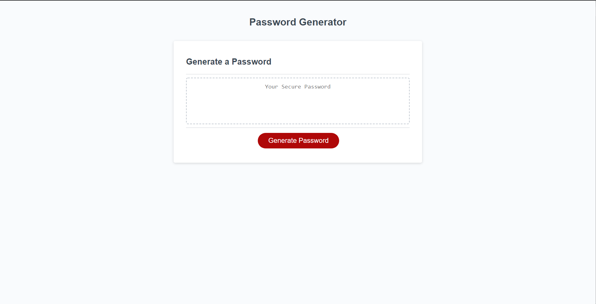

# About The Project
## Description
This is a simple Password Generator website.

The website is set up so it is simple to use and understand.
It uses simple javascript prompts to ask what you would like to add for your
password criteria.  Such as, password length, lower case, upper case, numeric and special
characters. After all the prompts have been checked and entered it will generate
a password to be copied and used.

### Built with
* Html
* Css
* Javascript

## GitHub page & Repository
* [Github page](https://mjbc53.github.io/Password-Generator/)
* [Github Repo](https://github.com/mjbc53/Password-Generator)

## Page screenshot

## Contact
* Email: mjbc53@gmail.com
* Github: [mjbc53](https://github.com/mjbc53)
